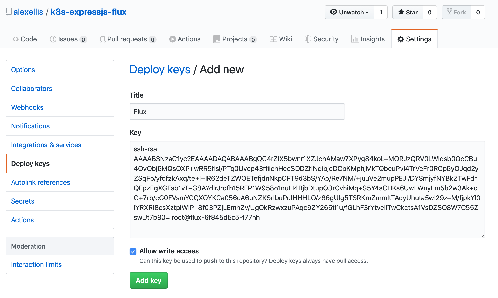

# GitOps for Node.js and Express.js using Helm3 and Flux

In this tutorial I'll show you how to build a GitOps pipeline for a Node.js application built with Express.js. The application was created in an earlier tutorial named: [Guide to Helm 3 With an Express.js Microservice](https://www.civo.com/learn/guide-to-helm-3-with-an-express-js-microservice). Rather than deploying new versions manually, flux will deploy it to Kubernetes whenever a build of the Docker image is available.


> Pictured: Flux conceptual workflow, copyright Flux Authors & CNCF &reg;.

## The components

* [Kubernetes](https://kubernetes.io/) will be required for this tutorial, so you can either bring your own, use the Civo's managed k3s product, or `k3sup`

* [A free GitHub account](https://github.com/) for Flux to monitor your config repo

* [Flux CD](https://github.com/fluxcd) was created by [Weaveworks](https://www.weave.works) and is now hosted within the Cloud Native Computing Foundation, a neutral home for OSS. Flux can apply Kubernetes manifest YAML files to your cluster from a Git repository. Its true power comes in being able to bump the versions of images as they are produced by your CI system.

* [Helm3](https://helm.sh) is the successor to Helm 2 and tightens-up security

* [Flux Helm Operator](https://github.com/fluxcd/helm-operator) - the Helm operator is not required for use with Flux, but makes a good pairing, so that Flux applies a custom resource, and then the helm operator installs the selected version of the chart.

* [Express.js](https://expressjs.com) is one of the most popular microservices frameworks for Node.js and makes it easy to define APIs, add authentication, integrate with middleware, and to server static sites. 

### Why FluxCD and what are the alternatives?

At the end of the tutorial, every new version of our app will be automatically updated in the cluster. What's more, if we delete our cluster by accident, we can recover in a short period of time since Git remains the source of truth.

Flux is one of the best-known tools for CD within the [CNCF landscape](https://landscape.cncf.io) and has been the topic for many sessions, tutorials, and workshops at [KubeCon](https://www.cncf.io).


There are other tools available for continuous deployment including [Argo](https://argoproj.github.io) from [Intuit](https://www.intuit.com). Argo may be more suited to developers who prefer a graphical dashboard and visualisation of their cluster state. There is some good news though, Argo and Flux will be merging some core components, so watch this space.

You may enjoy this video session from KubeCon: [Panel: GitOps User Stories with Weaveworks and Intuit](https://www.youtube.com/watch?v=ogw6_Y3WBQs)

## Tutorial

This tutorial should take around 1-2 hours and requires an immediate to advanced level of knowledge. If this seems like too much, then the previous tutorial in the series on [creating the Helm3 chart we use in this tutorial](https://www.civo.com/learn/guide-to-helm-3-with-an-express-js-microservice), may be a better place to begin the journey.

### Get a Kubernetes cluster

If you're a part of the [#KUBE100 program](https://www.civo.com/blog/kube100-is-here), then create a new cluster in your Civo dashboard and configure your `kubectl` to point at the new cluster.

> For a full walk-through of Civo k3s you can see my blog post - [The World's First Managed k3s](https://blog.alexellis.io/the-worlds-first-managed-k3s/)

Alternatively, you can use any other Kubernetes cluster, or if you are on Civo already but not in #KUBE100, then create a new Small or Medium Instance, then use [k3sup ('ketchup')](https://k3sup.dev).

To install k3s to a VM using `k3sup`, run::

```sh
export PUBLIC_IP=""  # Update with the public IP of your host from the Civo dashboard
export USER="civo"

k3sup install --ip $PUBLIC_IP --user $USER --merge --local-path $HOME/.kube/config
```

Before going any futher, check that you are pointing at the correct cluster:

```sh
kubectl config get-contexts

kubectl get node -o wide
```

### Get Helm 3

If you're using MacOS or Linux simply run the below:

```sh
curl https://raw.githubusercontent.com/helm/helm/master/scripts/get-helm-3 | bash
```

If you're a Windows user, then install [Git Bash](https://git-scm.com/downloads) and then run the above in a new terminal.

Check the installation:

```sh
$ helm version
version.BuildInfo{Version:"v3.0.0", GitCommit:"e29ce2a54e96cd02ccfce88bee4f58bb6e2a28b6", GitTreeState:"clean", GoVersion:"go1.13.4"}
```

### Create a GitHub repository for Flux

flux will store its state in a separate repository to your application code.

* CI or continuous integration builds new binaries or Docker images
* CD or continuous delivery deploys new versions of those previously built images

For this reason Flux uses a separate code and config repo.

Fork my repo under your own account:

https://github.com/alexellis/k8s-expressjs-flux

### Install Flux CD

fluxctl is the CLI to control and configure flux on your cluster.

* Install Helm v3 and fluxctl for macOS with [Homebrew](https://brew.sh):

    ```sh
    brew install helm fluxctl
    ```

    On Windows you can use [Chocolatey](https://chocolatey.org):

    ```sh
    choco install kubernetes-helm fluxctl
    ```

* Install the HelmRelease Kubernetes Custom Resource Definition (or CRD):

    ```sh
    kubectl apply -f https://raw.githubusercontent.com/fluxcd/helm-operator/master/deploy/flux-helm-release-crd.yaml
    ```

    [Custom Resource Definitions](https://kubernetes.io/docs/concepts/extend-kubernetes/api-extension/custom-resources/#customresourcedefinitions) allow developers to create their own objects with custom schemas for Kubernetes. This CRD represents a Helm chart release, but other CRDs may represent functions, such as [in OpenFaaS and its Operator](https://blog.alexellis.io/introducing-the-openfaas-operator/).

* Install Flux and the Helm Operator

    Add FluxCD repository to Helm repos:

    ```sh
    helm repo add fluxcd https://charts.fluxcd.io
    ```

* Create a namespace for flux

    ```sh
    kubectl create namespace fluxcd
    ```

* Install fluxcd and point it at your fork of my repo

    ```sh
    export USER="alexellis"
    helm upgrade -i flux fluxcd/flux --wait \
    --namespace fluxcd \
    --set git.url=git@github.com:$USER/k8s-expressjs-flux.git
    ```

    Flux uses an SSH key to read and/or write to your GitHub repository, this is called a Deployment Key. Get the pair and then add it to your GitHub repository's deployment keys.

    > Open GitHub, navigate to your repository, go to Settings > Deploy keys click on Add deploy key, check Allow write access, paste the Flux public key and click Add key.

    ```sh
    kubectl -n fluxcd logs deployment/flux | grep identity.pub | cut -d '"' -f2
    ```

    

* Install the HelmRelease Operator

    The helm release operator installs a release of a helm chart to your cluster.

    ```sh
    helm upgrade -i helm-operator fluxcd/helm-operator --wait \
    --namespace fluxcd \
    --set git.ssh.secretName=flux-git-deploy \
    --set helm.versions=v3
    ```

    You'll see in the `git.ssh.secretName` field that the `flux-git-deploy` deployment key is used for the operator. We also specify that we want to use Helm 3 here.

### View the sample app

Our test app serves a webpage which makes an API call back to retrieve some JSON. The JSON is rendered on the client-side in the browser and can be extended as required.

* View the sample: [alexellis/expressjs-k8s](https://github.com/alexellis/expressjs-k8s/)

We would normally install this app using helm or plain YAML files, as we did in the previous tutorial: [Guide to Helm 3 With an Express.js Microservice](https://www.civo.com/learn/guide-to-helm-3-with-an-express-js-microservice).

### View the config repo and HelmRelease

I used version 0.1.1 of the chart, but here's how you can find what version is available for your chart:

```sh
# First add the helm repo
helm repo add expressjs-k8s https://alexellis.github.io/expressjs-k8s/

# Then run an update
helm repo update

# Now search
helm3 search repo expressjs-k8s
```

We set up a HelmRelease object for Flux to apply to our cluster in the `/releases/` folder:

```yaml
apiVersion: helm.fluxcd.io/v1
kind: HelmRelease
metadata:
  name: expressjs-k8s
spec:
  chart:
    repository: https://alexellis.github.io/expressjs-k8s/
    name: expressjs-k8s
    version: 0.1.1
  values:
    ingress:
      enabled: false
```

The first section says where the release CRD will be applied, for instance we can specify a Kubernetes namespace here such as `dev` or `prod`.

The second part is the `spec`, here we can state the repository URL we'd normally use with a helm command and the target version.

The values file can be used to control versions of Docker images or other settings like whether to create ingress records.

Verify that the application was applied:

```sh
$ fluxctl sync --k8s-fwd-ns fluxcd

Synchronizing with ssh://git@github.com/alexellis/k8s-expressjs-flux.git
Revision of master to apply is 23f65ef
Waiting for 23f65ef to be applied ...
Done.
```

After syncing, we'll now see the HelmRelease custom resources created:

```sh
kubectl get helmrelease  -A

NAMESPACE   NAME            RELEASE                 STATUS     MESSAGE                       AGE
default     expressjs-k8s   default-expressjs-k8s   deployed   Helm release sync succeeded   6m
```

You can get even more detail with `kubectl describe helmrelease/expressjs-k8s`

We can also see the effect of the Helm Operator, which installed the helm chart at the version we specified 0.1.1:

```sh
$ kubectl get deploy -o wide
NAME                    READY   UP-TO-DATE   AVAILABLE   AGE   CONTAINERS      IMAGES                     SELECTOR
default-expressjs-k8s   1/1     1            1           84s   expressjs-k8s   alexellis2/service:0.3.5   app.kubernetes.io/instance=default-expressjs-k8s,app.kubernetes.io/name=expressjs-k8s
```

Optionally, you can invoke the service:

```sh
$ kubectl port-forward deploy/default-expressjs-k8s 8080:8080 &

# Then:

$ curl -s localhost:8080/links |jq

[
  {
    "name": "github",
    "url": "https://github.com/alexellis"
  },
  {
    "name": "twitter",
    "url": "https://twitter.com/alexellisuk"
  },
  {
    "name": "blog",
    "url": "https://blog.alexellis.io"
  },
  {
    "name": "sponsors",
    "url": "https://github.com/users/alexellis/sponsorship"
  }
]

# Finally:

kill %1
```

Or view the main website in a browser:


Notice the Copyright is set to 2019, that won't do since we're now in 2020 at time of writing.

### Automate deployments for new versions

Now Flux can apply our HelmRelease definition automatically, and the Helm Operator will then install the chart, but there's more we can do.

Flux can now automate new versions of the chart for changes according to a set of versioning policies for [semver](https://semver.org/), such "as always update to a new version of a patch release".

From semver.org:

> Given a version number MAJOR.MINOR.PATCH, increment the:

> MAJOR version when you make incompatible API changes,
> MINOR version when you add functionality in a backwards compatible manner, and
> PATCH version when you make backwards compatible bug fixes.
> Additional labels for pre-release and build metadata are available as extensions to the MAJOR.MINOR.PATCH format.

So we should be able to write a policy that increments all PATCH versions without us having to manually touch our cluster. Flux has write access through the deployment key, which is how we can make a permanent change from i.e. `0.1.1` to `0.1.2`.

When we're done, we'll also see commit message from Flux in our config repo. You can probably see why having a shared repo for code and config wouldn't work for Flux, it would end-up in a loop.


> Diagram: Copyright Stefan Prodan, Weaveworks

This diagram shows how Flux can scan the Docker images that you've pushed and then apply new versions through the values.yaml or spec override for a helm chart. 

```yaml
apiVersion: helm.fluxcd.io/v1
kind: HelmRelease
metadata:
  name: expressjs-k8s
  annotations:
    fluxcd.io/automated: "true"
    filter.fluxcd.io/chart-image: semver:~0.3
spec:
  chart:
    repository: https://alexellis.github.io/expressjs-k8s/
    name: expressjs-k8s
    version: 0.1.1
  values:
    ingress:
      enabled: false
    image: alexellis2/service:0.3.5
```

What did we change to automate release bumping?

* `fluxcd.io/automated: "true"` - this was added as an annotation to enable automation
* `filter.fluxcd.io/chart-image: semver:~0.3` was added to update any images that have a patch release for 0.3, but if we want to move to 0.4, we'd have to update the string to match that.
* `image: alexellis2/service:0.3.5` we added to the values, which represents `values.yaml` in a normal, manual Helm installation

Now we can push a new version of the expressjs-k8s Docker image, i.e. from version `alexellis2/service:0.3.5` to `alexellis2/service:0.3.5`. This matches our semver notation of `~0.3`.

### See flux in action

Here's our list of Git commits, we can see that Flux made a successful patch to the config repo.


This is the code diff


And we can also see the updated version and HelmRelease in the cluster:

```sh
$ kubectl get helmrelease/expressjs-k8s -o yaml

apiVersion: helm.fluxcd.io/v1
kind: HelmRelease
metadata:
  annotations:
    filter.fluxcd.io/chart-image: semver:~0.3
    fluxcd.io/automated: "true"
    fluxcd.io/sync-checksum: 6030a2af3ca9b68aef5475c5819b5e35a6bf019a
spec:
  chart:
    name: expressjs-k8s
    repository: https://alexellis.github.io/expressjs-k8s/
    version: 0.1.1
  values:
    image: alexellis2/service:0.3.6
    ingress:
      enabled: false
```

And the version has been applied and is serving the 2020 copyright string:

```
$ kubectl get deploy -o wide
NAME                    READY   UP-TO-DATE   AVAILABLE   AGE   CONTAINERS      IMAGES                   
default-expressjs-k8s   1/1     1            1           31m   expressjs-k8s   alexellis2/service:0.3.6
```

Run the `port-forward` command from earlier and then open a browser:


From here, it's over to you to build your own applications and deploy them to your Kubernetes cluster using the power of Flux and Continuous Delivery. Read on for how to troubleshoot and for the conclusion.

### Troubleshooting

You can troubleshoot flux like this:

```sh
kubectl logs -n fluxcd deploy/flux
```

And the helm Operator like this:

```sh
kubectl logs -n fluxcd deploy/helm-operator
```

## Wrapping up

We now have an example of how to continuously deploy our Express.js application to our Kubernetes cluster of choice.

Note that whilst the helm operator is currently included in the [Flux GitHub repository](https://github.com/fluxcd/flux), it will be extracted to a separate component later, and Flux can be used to apply any kind of Kubernetes objects and CRDs.

If you want to use secrets with your application, you can encrypt them using [SealedSecrets](https://github.com/bitnami-labs/sealed-secrets), a project from [Bitnami Labs](https://github.com/bitnami-labs). You can even deploy OpenFaaS and a set of OpenFaaS functions using the HelmRelease Operator, see this great tutorial by one of the Flux maintainers ([Stefan Prodan](https://github.com/stefanprodan)) for more: [Applying GitOps to OpenFaaS with Flux Helm Operator
](https://www.openfaas.com/blog/openfaas-flux/).

To find out more about Flux and to connect with its community, see [the project homepage](https://fluxcd.io).
